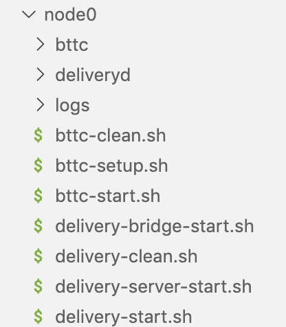

# Node Deployment

## Dependencies and Tools

- Git v2.30.1
- g++
- Go 1.16 +
- Nodejs v11.0
- Rabbitmq(latest stable version)
- Solc v0.5.11^
- Ganache CLI

## Compile & Install Delivery and BTTC Binary Packages

::: tip NOTE
The genesis configuration and node id needed for deployment are all placed in [launch](https://github.com/bttcprotocol/launch.git)
:::

### Clone Delivery Code

```sh
git clone https://github.com/bttcprotocol/delivery.git
```

### Install Delivery

```sh
cd delivery
make install
```

::: tip NOTE
When `make install` fails in some environments, please use `make build` and replace `deliveryd` in `delivery-start.sh` with the delivered path under the build folder.
:::

### Clone BTTC Code

```sh
git clone https://github.com/bttcprotocol/bttc
```

### Install BTTC

```sh
cd bttc
make bttc
```

## Install bttc-cli Script

::: tip NOTE
When bttc-cli is updated, please uninstall the local old version first, and then reinstall the latest version.
:::

```sh
npm uninstall -g bttc-cli
npm install -g @bttcnetwork/bttc-cli
```

### Check bttc-cli Version

```sh
bttc-cli -V
```

## Deploy Node

Use the following command to initialize the node directory:

```sh
bttc-cli setup devnet
```

Then fill in the following questions one by one, please pay attention to the difference between the main network and the test network

### BTTC Test Net (Donau, 1029)

```sh
? Please enter Bttc chain id 1029
? Please enter Delivery chain id delivery-1029
? Please enter Bttc branch or tag master
? Please enter Delivery branch or tag release_1.0.0
? Please enter Contracts branch or tag stake
? Please enter number of validator nodes 0 # number of block procducing nodes
? Please enter number of non-validator nodes 1 # number of full nodes
? Please enter ETH url https://goerli.infura.io/v3/<YOUR_INFURA_KEY>
? Please enter BSC url https://data-seed-prebsc-1-s1.binance.org:8545/
? Please enter TRON rpc url 47.252.19.181:50051
? Please enter TRON grid url http://172.18.1.136:8547
? Please select devnet type remote
? Please enter comma separated hosts/IPs
```

After running the above script, the following node directory will be generated



::: tip NOTE
In each .sh file, please ensure `NODE_DIR` is correct. In this example, `NODE_DIR` should be `/data/bttc/node0`.
:::

## Validator Configuration

Assume that the root directory of the node is in `/data/bttc/node0`.

### Configure the Delivery Seed Node

#### Node API_KEY Configuration

Modify the delivery-config file
Directory: `/data/bttc/node0/deliveryd/config/delivery-config.toml`

**Configuration instructions:**

- eth_rpc_url: For the API_KEY address you applied for, you need to generate INFURA_KEY yourself in order to communicate with Ethereum. [API_KEY Application Tutorial](https://ethereumico.io/knowledge-base/infura-api-key-guide)

- tron_rpc_url: RPC address of TRON network node.

- tron_grid_url: TRON network query node.

- bsc_rpc_url: RPC address of BSC network node.

**DEMO:**

```conf
vim /data/bttc/node0/deliveryd/config/delivery-config.toml
  
eth_rpc_url = "https://goerli.infura.io/v3/<YOUR_INFURA_KEY>"
bsc_rpc_url = "https://data-seed-prebsc-1-s1.binance.org:8545/"
tron_rpc_url = "47.252.19.181:50051"
tron_grid_url = "http://172.18.1.136:8547"
```

#### Replace Genesis file Configuration

Replace delivery-genesis.json in [genesis.json](https://github.com/bttcprotocol/launch/blob/master/testnet-1029/sentry/sentry/delivery/config/genesis.json) with the path: `/data/bttc/node0/deliveryd/config/genesis.json`.

#### Add node-ids of the Delivery Layer

Modify the seeds field of the configuration file `/data/bttc/node0/deliveryd/config/config.toml`. See the seed information in [here](https://github.com/bttcprotocol/launch/tree/master/testnet-1029/without-sentry/delivery).

### Start the Delivery node

#### Start Delivery

```sh
nohup sh delivery-start.sh>>logs/deliveryd.log 2>&1 &
```

#### Start Follow-up Service

```sh
nohup sh delivery-server-start.sh>>logs/rest-server.log 2>&1 &
nohup sh delivery-bridge-start.sh>>logs/bridge.log 2>&1 &
```

### Configure BTTC Seed Node

#### Replace BTTC's Genesis File

BTTC genesis file path: `/data/bttc/node0/bttc/genesis.json`

Replace `bttc-genesis.json` in [genesis.json](https://github.com/bttcprotocol/launch/blob/master/testnet-1029/sentry/sentry/bttc/genesis.json) with the above path.

#### Add node-ids of BTTC Seed Nodes

Replace `static-nodes.json` in [static-nodes.json](https://github.com/bttcprotocol/launch/blob/master/testnet-1029/sentry/sentry/bttc/static-nodes.json) with `/data/bttc/node0/bttc/static-nodes.json`.

### Initialize the BTTC Node

```sh
sh bttc-setup.sh
```

### Start BTTC Node

```sh
nohup sh bttc-start.sh >>logs/bttc-start.log 2>&1 &
```
