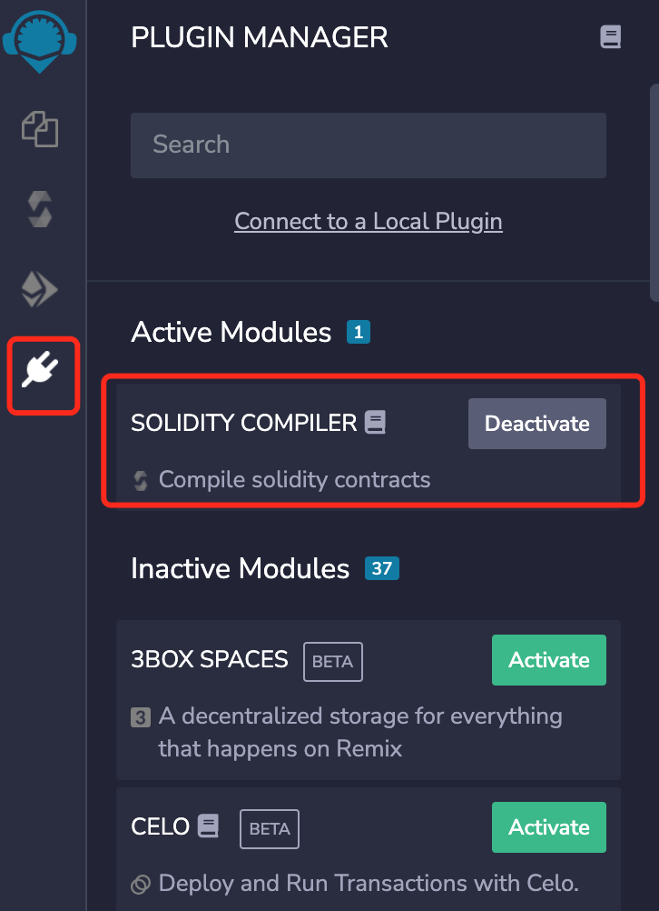
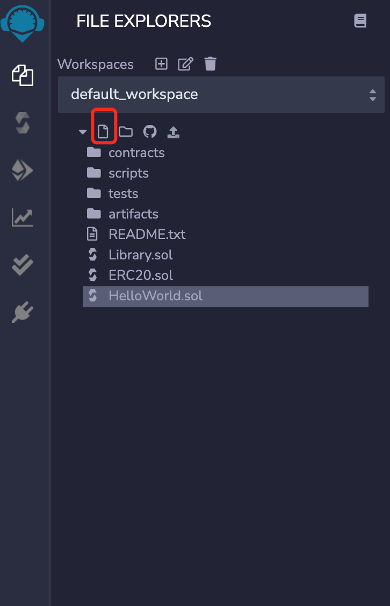
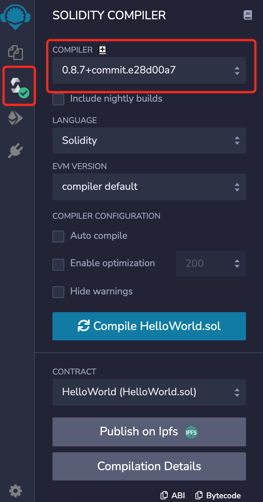
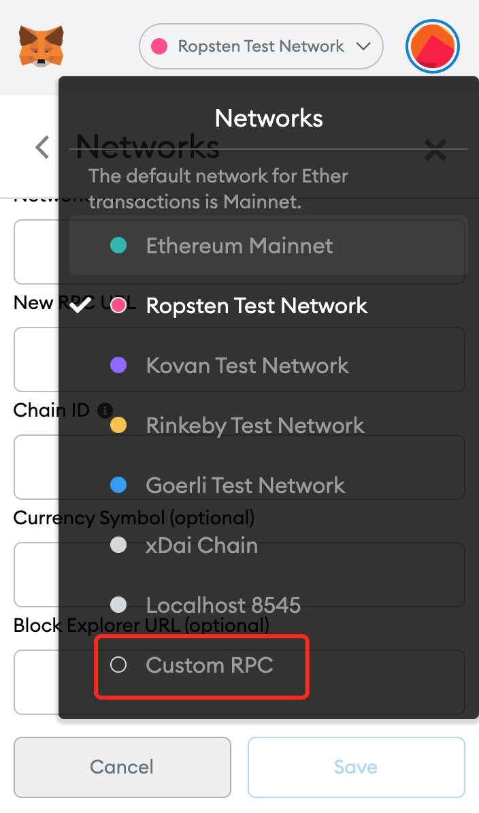
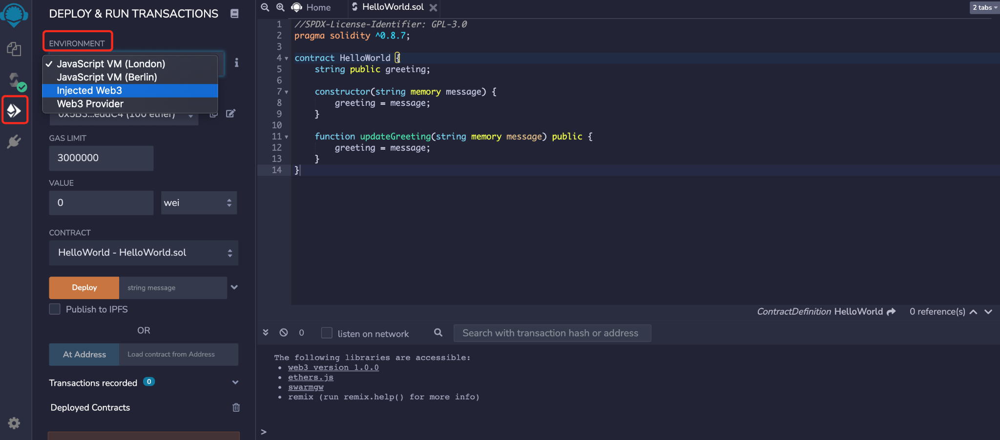
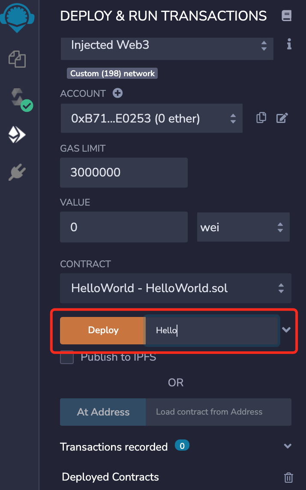
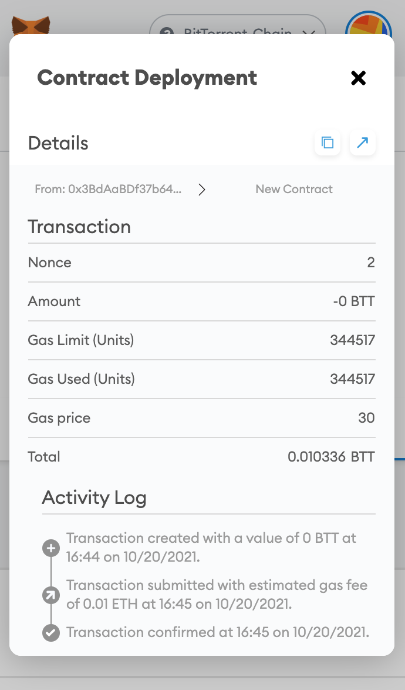
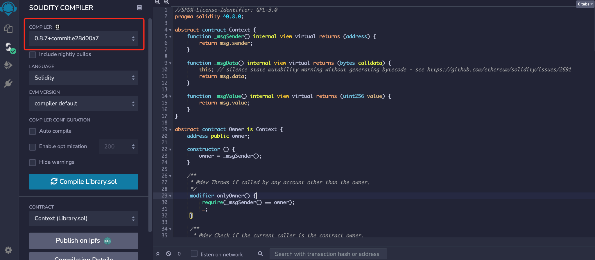
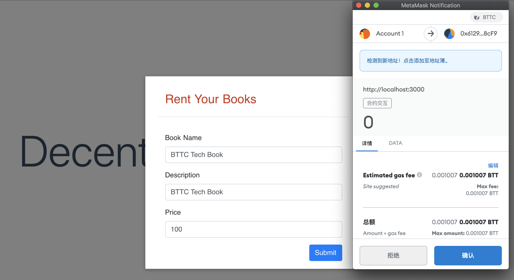

# BTTC合约开发教程

## 使用Remix在BTTC上部署Hello World合约

### 设置Remix

Remix是一个在线的智能合约IDE，可以用与编写、编译以及部署合约。

如果这是您首次使用Remix，需要在插件一栏中，找到“Solidity compiler”，并激活它，如下图



点击图中圈出的按钮，创建一个新文件，命名为HelloWorld.sol，并将下面的代码复制粘贴到这个文件中。



### HelloWorld.sol

```js
//SPDX-License-Identifier: GPL-3.0
pragma solidity ^0.8.7;

contract HelloWorld {
    string public greeting;
    
    constructor(string memory message) {
        greeting = message;
    }
    
    function updateGreeting(string memory message) public {
        greeting = message;
    }
}
```

第一行的`//SPDX-License-Identifier: GPL-3.0`表示这个智能合约是开源的，并且使用了GPL3.0的开源协议，可以根据需求自行选择其他开源协议。无协议时使用UNLICENSED。

第二行`pragma solidity ^0.8.7` 声明了编译器的版本。这个合约只能在0.8.7以及更高版本的Solidity编译器中才能编译成功。

`string public greeting`声明了一个名为`greeting`的字符串类型的public变量，这种变量称为state variable，会被永久保存在合约中以及区块链上。public关键字让这个变量可以从合约外部被访问，并为其创建一个accessor函数。

`constructor`声明了这个合约的构造函数。它可以接收一个string类型的参数message，将其存储在内存中，并将其值赋给greeting。请注意，每个智能合约中只能有一个构造函数，它仅会在部署合约时被调用。

`function updateGreeting`声明了一个普通函数，可以从外部调用，来修改greeting的内容。

### 编译合约

在左侧选择Solidity编译器，并选择0.8.7或者更高的版本。

点击Compile HelloWorld.sol。编译成功时，编译器图标会有绿色的对勾，如图所示。



### 网络设置

打开MetaMask钱包，并在如图的下拉选单中选择Custom RPC



按照图中的信息填写：

* 网络名称（Network Name）：BitTorrent Chain Donau
* RPC URL（RPC URL）：https://pre-rpc.bittorrentchain.io/ 
* 智能链ID（ChainID）：1029
* 符号（Symbol）：BTT
* 区块浏览器URL（Block Explorer URL）：https://testscan.bittorrentchain.io/


添加完成后的界面如下图所示


图中的测试账户已经预先存入了一些测试币。请前往水龙头来获取测试BTT。

完成了网络设置，接下来，就能在BTTC上部署智能合约了。

### 部署合约

首先，在Remix的DEPLOY & RUN TRANSACTIONS栏中，从Environment的下拉菜单里选择Injected Web3



在Deploy旁边的输入框中，输入初始的Greeting内容



点击Deploy后，MetaMask会弹出交易确认的窗口


恭喜，HelloWorld合约已经成功部署到了BTTC的测试网，现在您可以与它进行交互了，同时可以再浏览器上检查它的状态。



## 构建一个去中心化的图书馆

### 开发前准备

#### Nodej v10+

```sh
node -v
v10.24.1
```

#### Metamask

在[这里](https://chrome.google.com/webstore/detail/metamask/nkbihfbeogaeaoehlefnkodbefgpgknn)安装Metamask的Google Chrome插件。

### 我们在做什么？

我们将要构建一个包括以下功能的去中心化图书馆：

* 租书
* 查看可借书目
* 添加书

### 数据结构

对于借书者来说，通常，需要关心书的名字、内容、是否可借以及价格。基于此，我们在合约中创建一个名为Book的结构，它包括了如下的属性：

```js
struct Book {
       string name;
       string description;
       bool valid; // false if been borrowed
       uint256 price; // BTT per day
       address owner; // owner of the book
   }
```

我们希望图书馆能通过一个映射来记录每一本书。为此，这里分别创建了一个bookId的属性，以及bookId到Book的映射关系，命名为books。

```js
uint256 public bookId;

mapping (uint256 => Book) public books;
```

我们还需要记录每一本书的租借信息，包括借书者以及起止时间。

与Book相同，创建一个名为Tracking的结构来记录这些信息。这个结构包含了下面的属性：

```js
struct Tracking {
       uint256 bookId;
       uint256 startTime; // start time, in timestamp
       uint256 endTime; // end time, in timestamp
       address borrower; // borrower's address
   }
```

同样的，我们也需要建立一种映射关系，来管理每一次租借记录：

```js
uint256 public trackingId;

mapping(uint256 => Tracking) public trackings;
```

#### 定义功能和事件

我们需要为图书馆添加一些基本功能，包括：

* 为图书馆添加书籍 - addBook
* 借一本书 - borrowBook
* 从图书馆移除这本书 - deleteBook

##### addBook

```js
/**
    * @dev Add a Book with predefined `name`, `description` and `price`
    * to the library.
    *
    * Returns a boolean value indicating whether the operation succeeded.
    *
    * Emits a {NewBook} event.
    */
   function addBook(string memory name, string memory description, uint256 price) public returns (bool) {
       Book memory book = Book(name, description, true, price, _msgSender());

       books[bookId] = book;

       emit NewBook(bookId++);

       return true;
   }

   /**
    * @dev Emitted when a new book is added to the library.
    * Note bookId starts from 0.
    */
   event NewBook(uint256 bookId);
```

##### borrowBook

```js
   /**
    * @dev Borrow a book has `_bookId`. The rental period starts from
    * `startTime` ends with `endTime`.
    *
    * Returns a boolean value indicating whether the operation succeeded.
    *
    * Emits a `NewRental` event.
    */
   function borrowBook(uint256 _bookId, uint256 startTime, uint256 endTime) public payable returns(bool) {
       Book storage book = books[_bookId];

       require(book.valid == true, "The book is currently on loan");

       require(_msgValue() == book.price * _days(startTime, endTime), "Incorrect fund sent.");

       _sendBTT(book.owner, _msgValue());

       _createTracking(_bookId, startTime, endTime);

       emit NewRental(_bookId, trackingId++);
   }
```

##### deleteBook

```js
/**
    * @dev Delete a book from the library. Only the book's owner or the
    * library's owner is authorised for this operation.
    *
    * Returns a boolean value indicating whether the operation succeeded.
    *
    * Emits a `DeleteBook` event.
    */
   function deleteBook(uint256 _bookId) public returns(bool) {
       require(_msgSender() == books[_bookId].owner || isOwner(),
               "You are not authorised to delete this book.");
      
       delete books[_bookId];

       emit DeleteBook(_bookId);

       return true;
   }
```

在borrowBook方法中，我们用到了两个工具方法_sendBTT和_createTracking。我们不希望用户调用这些方法，因此，遵照Solidity的规则，我们把它们标记为internal，表示仅能在合约内部被调用。

##### _sendBTT

```js
/**
    * @dev Send BTT to the book's owner.
    */
   function _sendBTT(address receiver, uint256 value) internal {
       payable(address(uint160(receiver))).transfer(value);
   }
```

##### _createTracking

```js
/**
    * @dev Create a new rental tracking.
    */
   function _createTracking(uint256 _bookId, uint256 startTime, uint256 endTime) internal {
         trackings[trackingId] = Tracking(_bookId, startTime, endTime, _msgSender());

         Book storage book = books[_bookId];

         book.valid = false;
   }
```

现在我们已经完成了合约的编写工作，接下来就该部署上线了。

### 部署和测试

我们用[Remix](https://remix.ethereum.org/)来编译和部署合约。

部署合约需要燃烧BTT以支付gas。

打开MetaMask钱包，并在如图的下拉选单中选择Custom RPC


按照图中的信息填写：

* 网络名称（Network Name）：BitTorrent Chain Donau
* RPC URL（RPC URL）：https://pre-rpc.bittorrentchain.io/ 
* 智能链ID（ChainID）：1029
* 符号（Symbol）：BTT
* 区块浏览器URL（Block Explorer URL）：https://testscan.bittorrentchain.io/


首先，在Remix的DEPLOY & RUN TRANSACTIONS栏中，从Environment的下拉菜单里选择Injected Web3


选择0.8.0以及更高版本的编译器



点击Deploy后，MetaMask会弹出交易确认的窗口


恭喜，Library合约已经成功部署到了BTTC的测试网，现在您可以与它进行交互了，同时可以在浏览器上检查它的状态。

### 构建DApp

首先将上一步部署的合约地址粘贴到 utils.js 中的 libraryContractAddress 变量中。

#### 连接UI到Metamask

下一步我们需要将UI连接到Metamask Chrome 钱包,  Metamask Chrome扩展程序会将Web3对象注入每个浏览器页面，使得 DApp 能与 BTTC 网络进行交互。

在dapp-ui/plugins/utils.js中，创建如下函数来获取智能合约对象，并将其保存到全局变量中,接下来就可以直接使用全局变量来与合约交互了。

```js
export async function setLibraryContract() {
     var MyContract = web3.eth.contract(LibraryABI); 
     bookRentContract = await MyContract.at('0xe7BBc13a279f11D313B2c8304CdcDfC856C7603C');
}
```

#### 定义功能和函数

当我们的UI能够连接到Metamask之后，我要考虑我们的UI如何跟智能合约进行交互。所以我们要创建一个合约合约对象，表示去中心化图书馆智能合约。

图书馆DApp需要支持三个主要功能：

* 为图书馆添加书籍
* 查看所有可借书籍
* 借书

在index.vue中调用setLibraryContract()初始化合约对象。

```js
 async mounted() {
   // init contract object
   await setLibraryContract();
   // fetch all books
   const books = await fetchAllBooks();
   this.posts = books;
 },
```

##### 添加书籍

首先创建添加书籍表单，用于用户发布书籍出租信息。在后端，它将与library合约的addBook函数交互。

在dapp-ui/components/bookForm.vue的postAd()函数中添加如下代码：

```js
 postAd() {
     postBookInfo(this.title,this.description,this.price);
 }
```

在dapp-ui/plugins/utils.js的postBookInfo()中添加如下代码：

```js
const result = await bookRentContract.methods.addBook(name,description,price).send();
```

##### 查询所有可借书籍

通过`fetchAllBooks()`函数获取书籍列表，列出所有可借书籍。

在dapp-ui/plugins/utils.js的fetchAllBooks()函数中添加如下代码：

```js
 const books = [];

 const bookId  = await bookRentContract.methods.bookId().call();
 //iterate from 0 till bookId
 for (let i = 0; i < bookId; i++){
   const book = await bookRentContract.methods.books(i).call()
   if(book.name!="") // filter the deleted books
   {
     books.push(
       {id: i,name: book.name,description: book.description,price: book.price}
     )
   } 
 }
return books
```

在index.vue中调用`fetchAllBooks()`来获取书籍信息，并显示到主页上。

##### 借阅书籍

用户查看书籍信息后，可以借阅这本书。

在dapp-ui/components/detailsModal.vue的book()函数中添加如下代码：

```js
     // get Start date
     const startDay = this.getDayOfYear(this.startDate)
     // get End date
     const endDay = this.getDayOfYear(this.endDate)
     // price calculation
     const totalPrice =this.propData.price * (endDay - startDay)
     // call metamask.bookProperty
     borrowBook(this.propData.id, startDay, endDay, totalPrice)
```

dapp-ui/plugins/utils.js，在borrowBook()函数中添加如下代码：

```js
 const result = await bookRentContract.methods.borrowBook(spaceId,checkInDate,checkOutDate).send();
```

至此，图书馆DApp开发完毕。

### 运行DApp

确保Metamask为登录状态，然后执行如下命令来启动服务：

```sh
npm run dev
```

在浏览器地址栏输入：localhost:3000，查看前端页面。


点击右上角的”Rent Your Books”按钮，发布一条图书租赁信息。信息包括，图书名称，图书简要描述，图书借阅一天的价格。


信息填写完成后，点击”Submit”按钮，这些信息将发送给library合约的addBook函数，创建了一条触发合约的交易，然后将出现Metamask的弹框，要求确认并签名，如下所示：



交易成功上链后，这条租赁信息将显示到页面上：


点击”View”可查看书籍详细信息， 选择租赁的时间段，租赁的价格为：每天的租赁价格*租赁天数。点击”Lent Now”发起租赁请求。将触发library合约的borrowBook函数调用。同样需要签名及广播，然后完成租赁交易。


