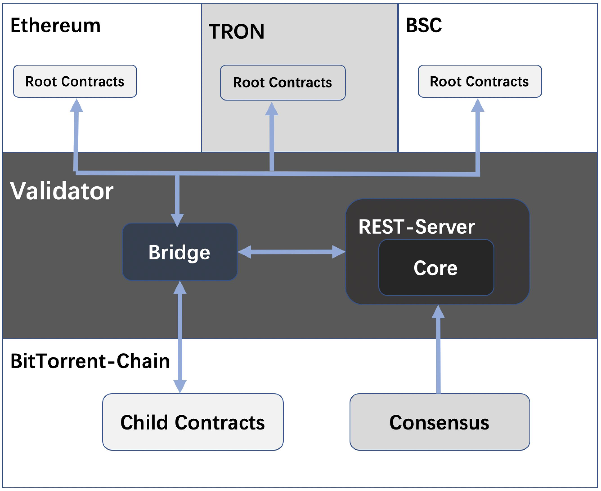

# 验证人和委托人

## 概述

BitTorrent-Chain 是一个区块链应用平台,如果您希望通过为BitTorrent-Chain设置节点来成validator,或者希望成为委托人以将代币委托给validator并获得奖励，可以通过该文档进行快速了解相关内容。

## PoS、质押和投票

### 股权证明(PoS)

权益证明 (PoS) 是公共区块链的一类共识算法，取决于验证人在网络中的经济权益。在基于工作量证明 (PoW) 的公共区块链（例如比特币和以太坊的当前实现）中，该算法奖励解决密码难题的参与者，以验证交易并创建新块（即挖矿）。在基于 PoS 的公共区块链中，一组验证人轮流对下一个区块进行提议和投票，每个验证人投票的权重取决于其存款（即权益）的大小。PoS 的显着优势包括 安全性、降低中心化风险和能源效率。

有关更多详细信息，请参阅 [https://github.com/ethereum/wiki/wiki/Proof-of-Stake-FAQ](https://github.com/ethereum/wiki/wiki/Proof-of-Stake-FAQ)。

### 质押

Staking 是指将代币锁定到存款中以获得在区块链上验证和生产区块的权利的过程。通常，质押是在网络的本机令牌中完成的。

### 投票

投票是代币持有者将其股份委托给验证人的过程。它允许不具备运行节点的技能或愿望的代币持有者参与网络，并根据投票的股份数量按比例获得奖励。

## 架构

BitTorrent-Chain 是一个区块链应用平台，整体结构分为三层：

* Root Contracts层：TRON及其他区块链网络上的Root合约，支持用户通过存取款的方式将代币映射到 BitTorrent-Chain，及支持质押等功能。
* Validator层: 验证BitTorrent-Chain区块，定期发送Checkpoint至支持的TRON及其他区块链网络。

    **Bridge**：负责监听各链路事件，发送事件消息等。

    **Core**：共识模块，包括Checkpoint(BitTorrent-Chain链的状态快照)的验证，Statesync事件&Staking事件的共识。  

    **REST-Server**：提供相关API服务。

* BitTorrent-Chain层。

## 代码库

BitTorrent-Chain的代码库，用于了解BitTorrent-Chain 核心组件如何工作。

一旦熟悉了架构和代码库，您就可以设置您的节点。请注意，上面的文档只是为了让您熟悉多边形内部的工作原理，您可以直接设置节点而不熟悉上面的规格。

## 设置节点

请参考节点设置[文档](http://doc.bittorrentchain.io/v1/doc/simplified/validator/node.html "文档")

## 委托人

成为 BitTorrent-chain 的委托人没有先决条件。您所要做的就是拥有一个TRON帐户。

### 什么是委托人

委托人无需托管完整节点即可参与验证。他们可以将BTT代币投票给验证人，并获得部分奖励作为交换。因为他们与验证人共享奖励，所以委托人也分担了风险。委托人在系统中起着至关重要的作用，因为他们可以根据自己的意愿选择验证人。

### 成为委托人

委托人可以将BTT代币委托给validator，并获得部分收入作为交换。成为BitTorrent-Chain 的委托人没有先决条件，只需要拥有一个TRON账户。

### 如何为验证人投票

相关合约方法：`ValidatorShare:buyVoucher(uint256, uint256)`

参数：

+ `_amount`：投票数量
+ `_minSharesToMint`：可接受的最少代理币数量

### 领取奖励

相关合约方法：`StakeManagerProxy:withdrawRewards(uint256)`

参数：

+ validatorId：领取奖励的validator id

### 取消投票

相关合约方法：`ValidatorShare:(uint256, uint256)`

参数：

+ uint256 claimAmount：数量
+ uint256 maximumSharesToBurn：可接受的燃烧最大代理币数量

### 奖励复投

相关合约方法：`ValidatorShare:reStake()`

### 转移投票

相关合约方法：`StakeManagerProxy:sellVoucher_new(uint256, uint256)`

参数：

+ uint256 claimAmount：解释数量
+ uint256 maximumSharesToBurn：可接受的燃烧最大代理币数量

## 验证人

### 什么是验证人

验证人(Validator)是网络中的参与者，他将代币锁定在网络中并运行验证人节点以帮助运行网络。验证人有以下职责：

* 质押网络令牌并运行验证人节点以作为验证器加入网络
* 通过验证区块链上的状态转换获得质押奖励
* 因停机等活动而受到处罚

区块链验证人是负责验证区块链内交易的人，对于 BitTorrent-Chain，任何参与者都可以通过运行全节点获得奖励和交易费用，从而有资格成为BitTorrent-Chain的验证人。BitTorrent-Chain中的验证人是通过定期发生的链上拍卖过程选择的，这些选定的验证人将作为区块生产者和验证者参与。

### 架构

BitTorrent-Chain 网络分为3层

#### Root Contracts

TRON及其他区块链网络上的Root合约，支持用户通过存取款的方式将代币映射到 BitTorrent-Chain，及支持质押等功能。

#### Validator

验证BitTorrent-Chain区块，定期发送Checkpoint至支持的TRON及其他区块链网络。

**Bridge**：负责监听各链路事件，发送事件消息等。

**Core**：共识模块，包括Checkpoint(BitTorrent-Chain链的状态快照)的验证，Statesync事件&Staking事件的共识。  

**REST-Server**：提供相关API服务。

#### BitTorrent-Chain

BitTorrent-Chain层的区块生产者是验证者的一个子集，由验证人定期改组。

### 功能

区块链验证人是负责验证区块链内交易的人。对于BitTorrent-Chain来说，任何参与者都有资格成为BitTorrent-Chain的验证人，通过运行一个完整的节点来获得奖励和交易费用。为了确保验证人的良好参与，他们锁定了他们的一些BTT代币作为生态系统的股份。

BitTorrent-Chain的验证人是通过链上的质押来选择的，这个过程会定期进行。这些被选中的验证人，作为区块生产者和验证者参与其中。一旦一个检查点（一组区块）被参与者验证，那么就会在TRON&以太坊&BSC上进行更新，根据验证人在网络中的股份，为其发放奖励。

#### 验证人的职责

* 通过在TRON上的质押合约中锁定BTT代币来加入网络。
* 验证人可以随时退出系统，可以通过unstake 在合约上执行交易来完成，
* 验证人可以随时增加质押BTT代币数量，以增加质押能力。
* 设置验证人节点后，验证人将执行以下操作：

    1.区块生产者选择

    2.在BitTorrent-Chain 上验证块

    3.检查点提交

    4.在以太坊上同步对BitTorrent-Chain 质押合约的更改

    5.从TRON&以太坊&BSC 到BitTorrent-Chain层的状态同步

* 验证人需要保持最低数量的代币来支付相关链上的交易费用。

#### Validator层

Validator层将BitTorrent-Chain产生的区块聚合成默克尔树，并定期将默克尔根发布到根链。这种定期发布被称为“检查点”。对于 BitTorrent-Chain 上的每几个区块，一个验证人（Validator）：

1. 验证自上次检查点以来的所有块
2. 创建块哈希的默克尔树
3. 将merkle root发布到主链

检查点很重要，原因有两个：

1. 在根链上提供终结性
2. 在提取资产时提供销毁证明

#### BitTorrent-Chain层

BitTorrent-chain层中的区块生产者，BitTorrent-chain层中的VM与EVM兼容，是一个基本的Geth实现，并对共识算法进行了自定义修改。

#### 检查点机制(Checkpoint)

在Validator中通过Tendermint的加权轮回算法来选择一个提议者，在Tendermint上成功提交一个检查点有2个阶段的提交过程，一个是通过上述Tendermint算法选择的提议者发送一个检查点，在提议者字段中包含他的地址，所有其他提议者在将其添加到他们的状态中之前将对此进行验证。

然后下一个提议者发送一个确认交易，以证明之前的检查点交易在以太坊主网中已经成功了。每一个验证者集的变化将由Validator上的验证人节点转发，该节点被嵌入到验证人节点上。这使得验证人在任何时候都能与TRON&Ethereum等链上的BitTorrent-chain合约状态保持同步。

部署在TRON&Ethereum等链上的BitTorrent-chain合约被认为是最终的真相来源，因此所有的验证都是通过查询TRON&Ethereum等链上的BitTorrent-chain合约完成的。

#### 质押

对于BitTorrent-chain来说，任何参与者都可以通过运行全节点有资格成为BitTorrent-chain的验证人，他们的成为验证人的主要动机是赚取奖励和交易费。

Validator有两个地址：

1. Owner 地址：验证人可以从该地址处理与管理相关的功能，比如取消抵押、获取奖励、设置委托参数。
2. Signer 地址：验证人从这个地址签署检查点并运行节点。

##### 质押流程

* 保证卡槽数量validatorThreshold（StakeManagerProxy读方法查询）大于当前validator数量（通过StakeManagerProxy合约validatorState方法查看）。
* 准备一个拥有至少500TRX的TRON地址Address_A。
* 给地址Address_A转一定数量BTT，至少2个token（注意精度的18个0）。
* 地址Address_A调用StakeManagerProxy的approve方法进行指定数量的BTT。
* 使用地址Address_A调用StakeManagerProxy的stakeFor方法进行质押，参数如下
 user：账户A地址

 amount：质押量，小于授权量，需精度的18个0
 deliveryFee：手续费，大于等于1个token，需精度的18个0

 acceptDelegation：false（如果为true的话，stakeFor不能通过tronscan调用，因为tronscan费用限制为300TRX，可通过wallet cli、API等调用

 signerPubkey：账户A公钥，需要把前导“04”去掉

* 交易执行成功即质押成功。
* 用户质押成功后可通过地址Address_A的address，访问stakeManagerProxy的getValidatorId方法获取validator id，然后通过validators方法，输入id获取validator详细信息，判断质押是否成功。

##### 取消质押流程

当验证人想退出系统，停止验证区块和提交检查点时，验证人可以取消质押。为了保证良好的参与度，取消质押的验证人的质押部分代币将被锁定withdrawalDelay个周期。

* 后续用户可通过unstake方法来退出，退出后立马返还奖励代币。质押部分的代币需要通过unclaim函数来申领
* unclaim方法必须等待withdrawalDelay个周期后才可以

##### 质押相关合约接口说明

|合约|方法|参数|备注|
|--------|--------|--------|--------|
| StakeManagerProxy | stakeFor | address user：质押账号地址 uint256 amount：质押代币数量，带精度 uint256 deliveryFee：手续费 bool acceptDelegation：是否接受代理 bytes memory signerPubkey：签名账号公钥 | 质押成为validator，validator集合未满时有效，否则报validator集合已满 |
|StakeManagerProxy|restake|uint256 validatorId：质押的validator id uint256 amount：质押数量 bool stakeRewards：奖励是否加入质押|追加质押|
|StakeManagerProxy|withdrawRewards|uint256 validatorId：领取奖励的validator id|领取奖励|
|StakeManagerProxy|unstake|uint256 validatorId：解除质押的validator id|解除质押|
|StakeManagerProxy|unstakeClaim|uint256 validatorId：领取质押的validator id|领取质押，解除质押后WITHDRAWAL_DELAY个epoch后可领取|
|StakeManagerProxy|updateSigner|uint256 validatorId：validator id bytes memory signerPubkey：新签名公钥|更新validator签名公钥|
|StakeManagerProxy|topUpForFee|user：手续费接收者的账号地址 deliveryFee：手续费金额，带精度|存delivery层手续费|
|StakeManagerProxy|claimFee|uint256 accumFeeAmount：领取手续费数量 uint256 index：bytes memory proof：证明数据|领取手续费|
|StakeManagerProxy|updateCommissionRate|uint256 validatorId：validator id uint256 newCommissionRate：新佣金比例，<=100|更新佣金比例|
|ValidatorShare|buyVoucher|uint256 _amount：投票数量 uint256 _minSharesToMint：可接受的最少代理币数量|投票和追加投票|
|StakeManagerProxy|migrateDelegation|uint256 fromValidatorId：源validator id uint256 toValidatorId： 目的validator id uint256 amount：转移数量|转移投票|
|ValidatorShare|sellVoucher_new|uint256 claimAmount：解释数量 uint256 maximumSharesToBurn：可接受的燃烧最大代理币数量|解除投票|
|ValidatorShare|unstakeClaimTokens_new|uint256 unbondNonce：解绑nonce|提取投票，解除投票后WITHDRAWAL_DELAY个epoch后可领取|
|ValidatorShare|restake|无|奖励复投|
|ValidatorShare|withdrawRewards|无|领取投票奖励|

#### 交易费用

BitTorrent-chain层的每个区块生产者都将获得每个区块收取的一定比例的交易费用。

## 状态同步机制

Validator层上的验证人接收StateSynced事件并将其传递给BitTorrent-chain层。

接收者合约继承了IStateReceiver,相关自定义逻辑位于onStateReceive函数内。

Dapp/用户 需要做的事情是与state-sync 一起工作。

1. 调用StateSender合约的 `syncState()`函数。
2. 上述函数将触发`StateSynced(uint256 indexed id, address indexed contractAddress, bytes data);`事件
3. Validator层上的所有验证人都会收到这个事件。
4. 一旦Validator层上的状态同步交易被包含在一个区块中，它就会被添加到待定状态同步列表中。
5. BitTorrent-chain层节点通过API调用从旦Validator上获取待定的状态同步事件。
6. 接收者合同继承了IStateReceiver接口，解码数据字节和执行任何行动的自定义逻辑位于onStateReceive函数中。
