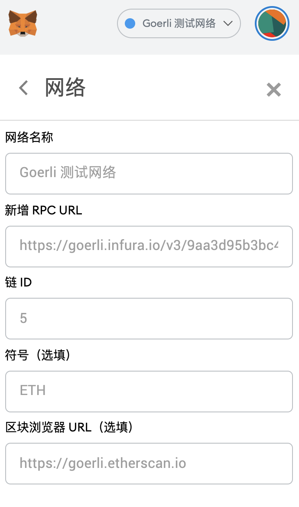
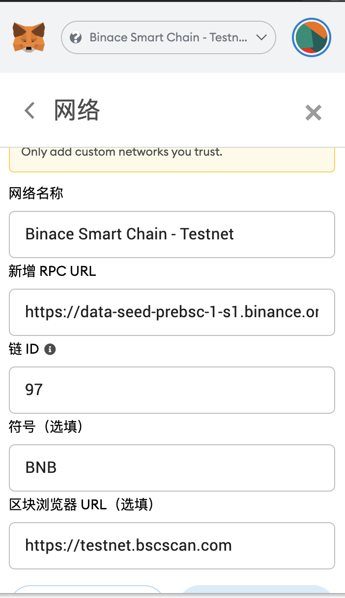

# BTTC测试网络

BitTorrent Chain（BTTC）测试网现已正式开启，目前已支持TRON测试网(Nile)，以太坊测试网(Goerli)以及BSC测试网的接入，简介如下：

| 公链  |  测试网络名称 |  URL |
| ------------ | ------------ | ------------ |
| TRON  | Nile  |  [Nile Faucet](https://nileex.io/join/getJoinPage) |
|  ETH |  Goerli | [Goerli Faucet](https://faucet.goerli.mudit.blog/)  |
|  BSC |  BSC测试网 | [BSC Faucet](https://testnet.binance.org/faucet-smart)  |
|  BTTC | BitTorrent Chain Donau  | [Donau Faucet](https://testfaucet.bittorrentchain.io/#)  |

## TRON Nile 测试网

Tron Nile测试网的接入需要使用Tronlink Chrome插件，并且Tronlink已支持Nile，用户在登录Tronlink钱包后需要切换至Nile测试网，通过水龙头申请测试币并发送至Tronlink账号，即可完成Nile测试网环境准备。

* Nile测试网代币申请URL：https://nileex.io/join/getJoinPage
* Nile测试网官网地址：https://nileex.io/
* Nile测试网区块浏览器：https://nile.tronscan.org/
* Nile测试网开发资源：​​https://nileex.io/status/getStatusPage

## ETH Goerli测试网

Goerli测试网的接入需要使用Metamask，并切换至Goerli测试网，申请测试币并发送至Metamask账号，即可完成Goerli测试网环境的准备。

如Metamask还未接入Goerli测试网，需要在Metamask上添加自定义RPC网络，参数如下：

* 网络名称（Network Name）：Goerli - Testnet
* RPC URL（RPC URL）：https://goerli.infura.io/v3/9aa3d95b3bc440fa88ea12eaa4456161
* 智能链ID（ChainID）：5
* 符号（Symbol）：ETH
* 区块浏览器URL（Block Explorer URL）：https://goerli.etherscan.com

详细操作流程可参考：[Metamask接入Goerli测试网流程](https://mudit.blog/getting-started-goerli-testnet/)。

## BSC测试网

BSC测试网的接入需要使用Metamask，并切换至Goerli测试网，通过水龙头申请测试币并发送至Metamask账号，即可完成BSC测试网环境准备。

如Metamask还未接入BSC测试网，需要在Metamask上添加自定义RPC网络，参数如下：

* 网络名称（Network Name）：Binace Smart Chain - Testnet
* RPC URL（RPC URL）：https://data-seed-prebsc-1-s1.binance.org:8545/
* 智能链ID（ChainID）：97
* 符号（Symbol）：BNB
* 区块浏览器URL（Block Explorer URL）：https://testnet.bscscan.com

详细操作流程可参考：[Metamask接入BSC测试网流程](https://academy.binance.com/en/articles/connecting-metamask-to-binance-smart-chain)。

## BTTC测试网

BTTC测试网的接入需要使用Metamask，并使用Metamask添加BTTC测试网的网络配置，并切换至BTTC测试网。

* 网络名称（Network Name）：BitTorrent Chain Donau
* RPC URL（RPC URL）：https://pre-rpc.bittorrentchain.io/ 
* 智能链ID（ChainID）：1029
* 符号（Symbol）：BTT
* 区块浏览器URL（Block Explorer URL）：https://testscan.bittorrentchain.io/

